# **Biomedical Data Analysis**

The following document the work done in the python notebook Analysis.ipynb, detailing the motivations behind each step and insights gained in the Data visualisation and Data Analysis section.

- [**Biomedical Data Analysis**](#biomedical-data-analysis)
  - [**Data and function preparation**](#data-and-function-preparation)
    - [**Create dataframes (Cell 1)**](#create-dataframes-cell-1)
    - [**Create functions for preprocessing (Cell 2)**](#create-functions-for-preprocessing-cell-2)
      - [**preprocessDf**](#preprocessdf)
    - [**Functions for analysis (Cell 3)**](#functions-for-analysis-cell-3)
      - [**outputCorrData**](#outputcorrdata)
      - [**compareClasModel**](#compareclasmodel)
      - [**compareRegModel**](#compareregmodel)
  - [**Data Visualisation**](#data-visualisation)
    - [**Generate histograms for each feature in each color category to check for distribution (Cell 4)**](#generate-histograms-for-each-feature-in-each-color-category-to-check-for-distribution-cell-4)
    - [**Display correlation of data in each parameter set (Cell 5)**](#display-correlation-of-data-in-each-parameter-set-cell-5)
    - [**Display correlation of physical functional parameters and LVEF (Cell 6)**](#display-correlation-of-physical-functional-parameters-and-lvef-cell-6)
    - [**Display correlation of physical functional parameters and E_A_ratio (Cell 7)**](#display-correlation-of-physical-functional-parameters-and-e_a_ratio-cell-7)
  - [**Data Analysis**](#data-analysis)
    - [**Use full data to classify cardiac category (Cell 8)**](#use-full-data-to-classify-cardiac-category-cell-8)
    - [**Use each feature set to predict cardiac category (Cell 9)**](#use-each-feature-set-to-predict-cardiac-category-cell-9)
    - [**Use of full data EXCEPT E_A_ratio to classify cardiac category (Cell 10)**](#use-of-full-data-except-e_a_ratio-to-classify-cardiac-category-cell-10)
    - [**Predicting cardiac category with *regression* using only echo parameters  (Cell 11)**](#predicting-cardiac-category-with-regression-using-only-echo-parameters--cell-11)
    - [**Using all feature (Except Cardiac Category) to predict E_A_ratio through regression (Cell 12)**](#using-all-feature-except-cardiac-category-to-predict-e_a_ratio-through-regression-cell-12)
    - [**Attempting to predict LVEF and E_A_ratio using physical functional parameters through regression (Cell 13)**](#attempting-to-predict-lvef-and-e_a_ratio-using-physical-functional-parameters-through-regression-cell-13)
    - [**Using all feature (Except echo and cmr) to classify cardiac category + check feature importance (Cell 14)**](#using-all-feature-except-echo-and-cmr-to-classify-cardiac-category--check-feature-importance-cell-14)
    - [**Manual extraction and combination of most important features in attempt to make a curated and predictive feature set (Cell 15)**](#manual-extraction-and-combination-of-most-important-features-in-attempt-to-make-a-curated-and-predictive-feature-set-cell-15)
  - [**Hyperparameter Tuning**](#hyperparameter-tuning)
    - [**Grid search for tuning LGBM to predict E_A_ratio using physical functional parameters (Cell 16)**](#grid-search-for-tuning-lgbm-to-predict-e_a_ratio-using-physical-functional-parameters-cell-16)
    - [**Grid search for tuning RandomForestRegressor to predict E_A_ratio using physical functional parameters (Cell 17)**](#grid-search-for-tuning-randomforestregressor-to-predict-e_a_ratio-using-physical-functional-parameters-cell-17)

<small><i><a href='http://ecotrust-canada.github.io/markdown-toc/'>Table of contents generated with markdown-toc</a></i></small>

## **Data and function preparation**

___

### **Create dataframes (Cell 1)**

<details>
<summary> 1. Read CSV file</summary>

```python
    data = pd.read_csv("kohsm1.csv",encoding='latin1')
```
</details>
<details>
<summary> 2. Remove the irrelevant white columns (ID data)</summary>

```python
    data.drop('IDshort', axis=1, inplace=True)
    data.drop('SERNO', axis=1, inplace=True)
```
</details>
<details>
<summary> 3. Define columns to be included in dataframe </summary>


```python
    clinParamsCols=["IDshort","Age","Weightkg","Heightcm","Pulse","WaistCircumferencecm","SERNO","Gender","SBP","DBP","Hips_Circumference__cm","Hypertension__Yes_1_No_0","Dyslipidemia__Yes_1_No_0","Diabetes_mellitus__Yes_1_No_0","Smoking__Never_0_Current_1_Past","DiabetesmellitusDietcontrol","AlcoholNever0Current1Past"]

    exerciseCols=["PhysicalactivityfrequencyIna","IntensityTakeiteasy1Heavy","Duration15min116to30min","VO2Max"]

    echoCols=["BSA__m2","IVSD__cm","IVSS__cm","LVIDD_cm","LVIDS_cm","LVPWD_cm","LVPWS_cm","LVOT__cm","AO_cm","LA_cm","LVEF","LVFS","LVmass_echo","LVmass_index_echo","Left_atrial_volume","Left_atrial_volume_index","MV_E_peak__m_s","MV_A_peak__m_s","E_A_ratio","MV_DT__ms","PASP__mmHg","PVS__cm_s","PVD__cm_s","PVA__cm_s","PVADur","MVADur","septalS","Septal_E","Septal_A","Lateral_S","lateralE","lateralA","sinuscm","sinus_tubular_junctioncm","ave_Eprime","E_Eprime_ratio"]

    cmrCols=["LV_Mass_on_mri__g","LV_EDV","EDV067","LV_ESV","LV_SV","LVEF_A","Ss","Se","Sa","SRs","SRe","SRa","SRe_SRaratio","LVGLS","LVGCS","LVGRS","RVGLS","LAGlobalGLS","LAGlobalGCS","LAvolumeminml","LAvolumemaxml","LAEFTotal","LVMassg","LVEDVImlm2","LVESVImlm2","LVSVImlm2"]

    bloodBioCols=["MCP1pgmL","MMP9ngmL","BNP","HSTNI","GALECTIN3","sUPAR","qTL","extra_urea","extra_creatinine","extra_total_cholesterol","extra_triglycerides","extra_HDL","extra_LDL","extra_tc_HDL_ratio","extra_albumin","extra_hsCRP","HbA1c"]

    physFuncParamsCols=["Gripmax","G1L","G2L","G1R","G2R","SMM","BFM","PBF","WHR","Fitness_score","BMR","Lean_LA","Lean_RA","Lean_LL","Lean_RL","Lean_T","ALM"]

    curMetaCols=["TC","FC","C2","C3","C4","C51","C5","C4OH","C6","C5OHC3DC","C4DCC6OH","C81","C8","C5DC","C81OHC61DC","C8OHC6DC","C103","C102","C101","C10","C7DC","C81DC","C8DC","C122","C121","C12","C122OHC102DC","C121OH","C12OHC10DC","C143","C142","C141","C14","C143OHC123DC","C142OH","C141OH","C14OHC12DC","C163","C162","C161","C16","C163OHC143DC","C162OH","C161OHC141DC","C16OH","C183","C182","C181","C18","C183OHC163DC","C182OHC162DC","C181OHC161DC","C18OHC16DC","C204","C203","C202","C201","C20","C203OHC183DC","C202OHC182DC","C201OHC181DC","C20OHC18DC","C225","C224","C223","C222","C221","C22","C24","C26","C28","Gly1","Ala1","Ser1","Pro1","Val1","Leu1","IleLeu1","Orn1","Met1","His1","Phe1","Arg1","Cit1","Tyr1","Asp1","Glu1","Trp1"]

    histMetaCols=["HistoC2","HistoC3","HistoC4","HistoC51","HistoC5","HistoC4NDOH","HistoC6","HistoC5NDOHC3NDDC","HistoC4NDDCC6NDOH","HistoC81","HistoC8","HistoC5NDDC","HistoC81NDOHC61NDDC","HistoC8NDOHC6NDDC","HistoC103","HistoC102","HistoC101","HistoC10","HistoC7NDDC","HistoC81NDDC","HistoC8NDDC","HistoC122","HistoC121","HistoC12","HistoC122NDOHC102NDDC","HistoC121NDOH","HistoC12NDOHC10NDDC","HistoC143","HistoC142","HistoC141","HistoC14","HistoC143NDOHC123NDDC","HistoC142NDOH","HistoC141NDOH","HistoC14NDOHC12NDDC","HistoC163","HistoC162","HistoC161","HistoC16","HistoC163NDOHC143NDDC","HistoC162NDOH","HistoC161NDOHC141NDDC","HistoC16NDOH","HistoC183","HistoC182","HistoC181","HistoC18","HistoC183NDOHC163NDDC","HistoC182NDOHC162NDDC","HistoC181NDOHC161NDDC","HistoC18NDOHC16NDDC","HistoC204","HistoC203","HistoC202","HistoC201","HistoC20","HistoC203NDOHC183NDDC","HistoC202NDOHC182NDDC","HistoC201NDOHC181NDDC","HistoC20NDOHC18NDDC","HistoC225","HistoC224","HistoC223","HistoC222","HistoC221","HistoC22","HistoC24","HistoC26","HistoC28","HistoCode","HistoGly1_ConcµM","HistoAla1_ConcµM","HistoSer1_ConcµM","HistoPro1_ConcµM","HistoVal1_ConcµM","HistoLeu1_ConcµM","HistoIle1_ConcµM","HistoOrn1_ConcµM","HistoMet1_ConcµM","HistoHis1_ConcµM","HistoPhe1_ConcµM","HistoCit1_ConcµM","HistoTyr1_ConcµM","HistoAsp1_ConcµM","HistoGlu1_ConcµM","HistoTrp1_ConcµM"]

    targets=["Cardiac_Category (0=good; 1=poor)","Cardiac_Category EE (0=good; 1=poor)"]

    clinParamsColsCC = clinParamsCols + [targets[0]]
    exerciseColsCC = exerciseCols + [targets[0]]
    echoColsCC = echoCols + [targets[0]]
    cmrColsCC = cmrCols + [targets[0]]
    bloodBioColsCC = bloodBioCols + [targets[0]]
    physFuncParamsColsCC = physFuncParamsCols + [targets[0]]
    curMetaColsCC = curMetaCols + [targets[0]]
    histMetaColsCC = histMetaCols + [targets[0]]
```
</details>
<details>
<summary> 4. Create dataframes according to the columns specified above. </summary>

```python
   clinParamsColsCC_df=data.loc[:, data.columns.isin(clinParamsColsCC)]
   exerciseColsCC_df=data.loc[:, data.columns.isin(exerciseColsCC)]
   echoColsCC_df=data.loc[:, data.columns.isin(echoColsCC)]
   cmrColsCC_df=data.loc[:, data.columns.isin(cmrColsCC)]
   bloodBioColsCC_df=data.loc[:, data.columns.isin(bloodBioColsCC)]
   physFuncParamsColsCC_df=data.loc[:, data.columns.isin(physFuncParamsColsCC)]
   curMetaColsCC_df=data.loc[:, data.columns.isin(curMetaColsCC)]
   histMetaColsCC_df=data.loc[:, data.columns.isin(histMetaColsCC)]
```

</details>
<details>

<summary> 5. Created dictionary of dataframes for iteration purposes. </summary>

```python
cc_dfDict = {
        "clinParams":clinParamsColsCC_df,
        "exercise":exerciseColsCC_df,
        "echo":echoColsCC_df,
        "cmr":cmrColsCC_df,
        "bloodBio":bloodBioColsCC_df,
        "physFuncParams":physFuncParamsColsCC_df,
        "curMeta":curMetaColsCC_df,
        "histMeta":histMetaColsCC_df
    }
```

</details>

### **Create functions for preprocessing (Cell 2)**

#### **preprocessDf**

Adapted from code found online.

```python
preprocessDf(df,threshold=40,verbose=False)
```

Expects a dataframe and does the following:

1. Converts categorical data with 2 values to binary (1s and 0s)
2. Converts remaining non-numerica data to NaN
3. Calculate % of missing values in each columns
4. Removes columns with more than threshold missing value (default 40%)
5. Returns a preprocessed dataframe

___
<details>
<summary>Code</summary>

```python
# Helper function for preprocessDf
def rmissingvaluecol(df, threshold):
    # If threshold is 80 it means we are going to drop columns having more than 80% of missing values
    l = []
    l = list(df.drop(df.loc[:,list((100*(df.isnull().sum()/len(df.index)) >= threshold))].columns, 1).columns.values)
    print("Number of columns having more than %s percent missing values: "%threshold, (df.shape[1] - len(l)))
    print("These columns are:\n", list(set(list((df.columns.values))) - set(l)))
    # Returns columns that are missing less than threshold % of data
    return l

def preprocessDf(df,threshold=40,verbose=False)
    print("Preprocessing dataframe...")
    if verbose:
        print("Initial info:")
        print(df.info())
    originalShape = df.shape
    newDf = df.copy()
    
    for col in newDf:
        # Checks for categorical columns that only have 2 values, and converts them to binary
        uniqueVals = pd.unique(newDf[col])
        if len(uniqueVals) == 2:
            if not(np.int64(0) in uniqueVals and np.int64(1) in uniqueVals):
                print(f"{col} column contains only 2 values. Converting to binary")
                print(uniqueVals[0])
                newDf[col] = np.where(newDf[col] == uniqueVals[0],np.int64(0),newDf[col])
                newDf[col] = np.where(newDf[col] == uniqueVals[1],np.int64(1),newDf[col])
                #Renames column with labels for binary values
                newDf.rename(columns={col:col + f"_{uniqueVals[0]}_0_{uniqueVals[1]}_1"}, inplace=True)
    
    # Converting values that are non-numeric to NA
    newDf = newDf.apply(pd.to_numeric,errors='coerce')
    print("Converting values that are non-numeric AND non-binary to NaN...")
    newCols = rmissingvaluecol(newDf,threshold) #Removes columns with more than threshold% (default is 40%) of missing data
    print("Columns with missing values (%):")
    newDf_missing = newDf.isna().sum()
    newDf_missing = newDf_missing[newDf_missing > 0].dropna().sort_values(ascending=False)
    newDf_missing = newDf_missing.apply(lambda x: np.round((x/originalShape[0])*100,2))
    print(newDf_missing)
    newDf = newDf[newCols]

    print(f"Original Shape:{df.shape}")
    print(f"Final Shape:{newDf.shape}")
    if verbose:
        print("Final info:")
        print(newDf.info())
    print("______________________________")
    # Returns preprocessed dataframe
    return newDf
```

</details>

___

### **Functions for analysis (Cell 3)**

#### **outputCorrData**

Accepts a dataframe, with optional parameters for threshold, filename and whether to save the data. Generates a correlation heatmap that only displays correlation pairs above the given threshold.

```python
outputCorrData(df,threshold=0.6,filename="Output",generateFiles=False)
```

___
<details>
<summary>Code</summary>

```python

# Display correlation data above given threshold
def outputCorrData(df,threshold=0.6,filename="Output",generateFiles=False):
    df = preprocessDf(df)
    df = df.fillna(df.median())
    # Creates correlation matrix
    corrDf = df.corr()
    # Creates corr matrix, showing correlations above given threshold
    filteredDf = corrDf[((corrDf >= threshold) | (corrDf <= -threshold)) & (corrDf !=1.000)]
    plt.figure(figsize=(20,17))
    sn.heatmap(filteredDf, annot=True, cmap="Reds")
    plt.title(f"{filename} Correlation Heatmap (Threshold: >= abs{threshold})",fontsize=20)
    # Returns a table of correlation indexes in descending order
    
    cmrCorrTable = get_top_abs_correlations(df, threshold).to_frame()
    cmrCorrTable.columns =['Abs Corr Idx']
    plt.show

    # Generates excel and png files of output in your system for future reference
    if generateFiles:
        if not os.path.exists('Outputs/Plots'):
            os.makedirs('Outputs/Plots')
        if not os.path.exists('Outputs/Tables'):
            os.makedirs('Outputs/Tables')
        plt.savefig(f'Outputs/Plots/corr_{filename}_heatmap.png')
        cmrCorrTable.to_excel(f'Outputs/Tables/corr_{filename}_table.xlsx') 
    return corrDf

```

</details>

___

#### **compareClasModel**

Compares performance of classification models.

```python
compareClasModel(df,target,test_size=0.25,title="Dataset",showImportance=False)
```

Accepts a dataframe and a string representing the name of the target column in the dataframe. Also accepts other optional parameters. Does the following tasks:

1. Splits dataframe into x (datapoints) and y (targets)
2. Preprocesses x (refer to cell 2 for overview of tasks performed)
3. Further splits x and y into training sets and testing sets (xTrain,xTest,yTrain and yTest)
4. Fills in missing values in the xTrain and xTest with the median of the column
5. Initialise and fits a list of classification models to be used and compared
6. Calculate accuracy (Percentage of correct predictions on test set), mean cross validation score (K-Fold cross validation) and mean cross val error for each model.
7. if showImportance = True, whenever the model allows for it, show the list of features that have the greatest influence in predicting the target.
8. Plots a comparison of the performance of different models and returns a dataframe representing this comparison.

___

<details>

<summary>Code</summary>

```python

def compareClasModel(df,target,test_size=0.25,title="Dataset",showImportance=False):
    print(f"Comparing models for {title}")
    y = df[target]
    df = df.drop(target, axis = 1)
    x = preprocessDf(df)
    
    print("Initialising models...")
    xTrain,xTest,yTrain,yTest = train_test_split(x,y,test_size=test_size,random_state=0)
    xTrain = xTrain.fillna(xTrain.median())
    xTest = xTest.fillna(xTrain.median())
    #https://stackoverflow.com/questions/18689823/pandas-dataframe-replace-nan-values-with-average-of-columns

    lr = LogisticRegression(solver="liblinear").fit(xTrain,yTrain)
    gnb = GaussianNB().fit(xTrain,yTrain)
    knnc = KNeighborsClassifier().fit(xTrain,yTrain)
    dtc = DecisionTreeClassifier(random_state=0).fit(xTrain,yTrain)
    rfc = RandomForestClassifier(random_state=0,verbose=False).fit(xTrain,yTrain)
    gbmc = GradientBoostingClassifier(verbose=False).fit(xTrain,yTrain)
    xgbc = XGBClassifier(use_label_encoder=False,eval_metric= "error").fit(xTrain,yTrain)
    lgbmc = LGBMClassifier().fit(xTrain,yTrain)
    sv = SVC().fit(xTrain,yTrain)

    models = [lr,gnb,knnc,dtc,rfc,gbmc,xgbc,lgbmc,sv]
    
    # initialise empty dataframe
    comparison = pd.DataFrame(columns=["Model","AccuracyScore","MeanR2CVScore","MeanCVError"])
    # Because dataset is small, we use k-fold cross validation
    import pandas as pd
    import shap
    import sklearn

    # a classic housing price dataset
    X,y = shap.datasets.(DataFrame)
    X100 = shap.utils.sample(X, 100) 
    a simple linear model
    model = sklearn.linear_model.LinearRegression()
    model.fit(X, y)

    for model in models:
        name = model.__class__.__name__
        predict = model.predict(xTest)
        accuracy = accuracy_score(yTest,predict)
        r2CV = cross_val_score(model,xTest,yTest,cv=5,scoring="r2").mean()
        error = -cross_val_score(model,xTest,yTest,cv=5,scoring="neg_mean_squared_error").mean()
        result = pd.DataFrame([[name,accuracy,r2CV,error]],columns=["Model","AccuracyScore","MeanR2CVScore","MeanCVError"])
        comparison = comparison.append(result)
        if showImportance:
            try:
                importance = model.feature_importances_
                plot_feature_importance(importance,xTest.columns.tolist(),name)
            except AttributeError:
                continue
    
    print(comparison)
    print("\n")
    print(f"Highest Accuracy Score: {comparison.loc[comparison['AccuracyScore'] == comparison['AccuracyScore'].max(), 'Model'].iloc[0]}. Score: {round(comparison['AccuracyScore'].max(),2)}")
    print(f"Highest CV Score: {comparison.loc[comparison['MeanR2CVScore'] == comparison['MeanR2CVScore'].max(), 'Model'].iloc[0]}. Score: {round(comparison['MeanR2CVScore'].max(),2)}")
    print(f"Lowest CV Error: {comparison.loc[comparison['MeanCVError'] == comparison['MeanCVError'].min(), 'Model'].iloc[0]}. Score: {round(comparison['MeanCVError'].min(),2)}")
    print("\n")
    comparisonMelted = pd.melt(comparison,id_vars=['Model'])

    #sn.set_theme(style="whitegrid")
    plt.ylabel('Returns')
    
    ax = sn.barplot(x="value", y="Model", hue="variable", data=comparisonMelted)
    plt.legend(title='Metrics',bbox_to_anchor=(1.05, 1), loc=2, borderaxespad=0.)
    ax.set(title=f"{title}",ylabel='Model',xlabel='Percentage Score')
    plt.xlim(0, 1)
    plt.show()
    #plt.xticks(rotation=90)
    print("***********************************************")
    
    return comparison

```

</details>

___

#### **compareRegModel**

Compares performance of regression models.

```python
compareRegModel(df,target,test_size=0.25,title="Dataset",showImportance=False)
```

Accepts a dataframe and a string representing the name of the target column in the dataframe. Also accepts other optional parameters. Does the following tasks:

1. Splits dataframe into x (datapoints) and y (targets)
2. Preprocesses x (refer to cell 2 for overview of tasks performed)
3. Further splits x and y into training sets and testing sets (xTrain,xTest,yTrain and yTest)
4. Fills in missing values in the xTrain and xTest with the median of the column
5. Initialise and fits a list of regression models to be used and compared
6. Calculate mean cross validation score (K-Fold cross validation) and mean cross val error for each model.
7. if showImportance = True, whenever the model allows for it, show the list of features that have the greatest influence in predicting the target.
8. Plots a comparison of the performance of different models and returns a dataframe representing this comparison.

___

<details>
<summary>Code</summary>

```python

def compareRegModel(df,target,test_size=0.25,title="Dataset",showImportance=False):
    print(f"Comparing models for {title}")
    y = df[target]
    df = df.drop(target, axis = 1)
    x = preprocessDf(df)
    
    print("Predicting " + title)
    xTrain,xTest,yTrain,yTest = train_test_split(x,y,test_size=test_size,random_state=0)
    xTrain = xTrain.fillna(xTrain.median())
    xTest = xTest.fillna(xTrain.median())
    #https://stackoverflow.com/questions/18689823/pandas-dataframe-replace-nan-values-with-average-of-columns

    lr = LinearRegression().fit(xTrain,yTrain)
    pls = PLSRegression().fit(xTrain,yTrain)
    ridge = Ridge().fit(xTrain,yTrain)
    lasso = Lasso().fit(xTrain,yTrain)
    elasticnet = ElasticNet().fit(xTrain,yTrain)
    knnr = KNeighborsRegressor().fit(xTrain,yTrain)
    dtr = DecisionTreeRegressor(random_state=0).fit(xTrain,yTrain)
    baggr = BaggingRegressor(random_state=0,bootstrap_features=True,verbose=False).fit(xTrain,yTrain)
    rfr = RandomForestRegressor(random_state=0,verbose=False).fit(xTrain,yTrain)
    gbmr = GradientBoostingRegressor(verbose=False).fit(xTrain,yTrain)
    xgbr = XGBRegressor().fit(xTrain,yTrain)
    lgbmr = LGBMRegressor().fit(xTrain,yTrain)
    sv = SVR().fit(xTrain,yTrain)

    models = [lr,pls,ridge,lasso,elasticnet,knnr,dtr,baggr,rfr,gbmr,xgbr,lgbmr,sv]
    
    # initialise empty dataframe
    comparison = pd.DataFrame(columns=["Model","MeanR2CVScore","MeanR2CVError"])
    # Because dataset is small, we use k-fold cross validation

    for model in models:
        name = model.__class__.__name__
        r2CV = cross_val_score(model,xTest,yTest,cv=5,scoring="r2").mean()
        error = -cross_val_score(model,xTest,yTest,cv=5,scoring="neg_mean_squared_error").mean()
        result = pd.DataFrame([[name,r2CV,error]],columns=["Model","MeanR2CVScore","MeanR2CVError"])
        comparison = comparison.append(result)
        if showImportance:
            try:
                importance = model.feature_importances_
                plot_feature_importance(importance,xTest.columns.tolist(),name)
            except AttributeError:
                continue
    
    print(comparison)
    print("\n")
    print(f"Highest R2CV Score: {comparison.loc[comparison['MeanR2CVScore'] == comparison['MeanR2CVScore'].max(), 'Model'].iloc[0]}. Score: {round(comparison['MeanR2CVScore'].max(),2)}")
    print(f"Lowest CV Error: {comparison.loc[comparison['MeanR2CVError'] == comparison['MeanR2CVError'].min(), 'Model'].iloc[0]}. Score: {round(comparison['MeanR2CVError'].min(),2)}")
    print("\n")
    comparison = comparison.drop(["MeanR2CVError"],axis = 1)
    comparisonMelted = pd.melt(comparison,id_vars=['Model'])

    #sn.set_theme(style="whitegrid")
    plt.ylabel('Returns')
    
    ax = sn.barplot(x="value", y="Model", hue="variable", data=comparisonMelted)
    plt.legend(title='Metrics',bbox_to_anchor=(1.05, 1), loc=2, borderaxespad=0.)
    ax.set(title=f"{title}",ylabel='Model',xlabel='Values')
    plt.xlim(-10,1)
    plt.show()
    #plt.xticks(rotation=90)
    print("***********************************************")
    
    return comparison

```

</details>

___

## **Data Visualisation**

___

### **Generate histograms for each feature in each color category to check for distribution (Cell 4)**

Motivation: Inspect the distribution of variables and look for outliers.

```python
for key in cc_dfDict:
    width = max(cc_dfDict[key].shape[1]*2,14)
    height = max(cc_dfDict[key].shape[1],7)
    ax = cc_dfDict[key].hist(figsize=(width,height))
    plt.suptitle(key, fontsize=width+height, ha='center', va ='center')
    plt.show()
```

Comments: Plots show the presence of significant outliers. Hence, Median should be used over Mean in calculating column averages (for the purposes of imputation of missing values, for example). Full results can be viewed in the notebook itself.

<details>
<summary>Example Output:</summary>

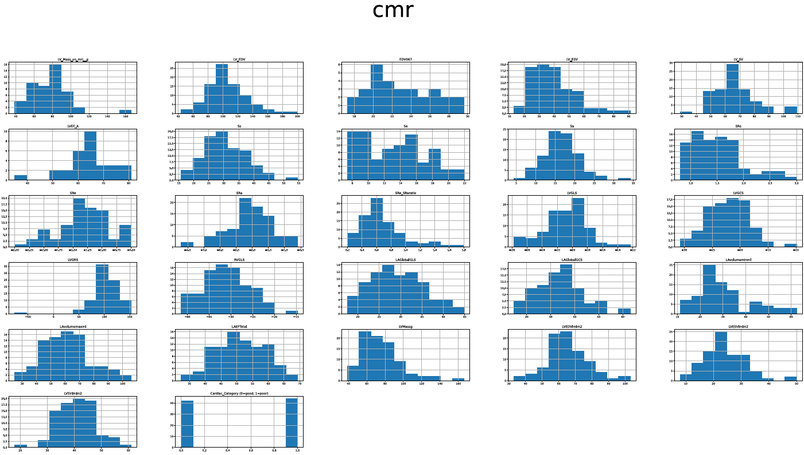

</details>
<br>

### **Display correlation of data in each parameter set (Cell 5)**

Motivation: To check for any interesting observations based on clinical experience.

```python
for key in cc_dfDict:
    print(f"Working on {key}")
    outputCorrData(cc_dfDict[key],filename=key,generateFiles=False)
```

<details>
<summary>Example Output</summary>

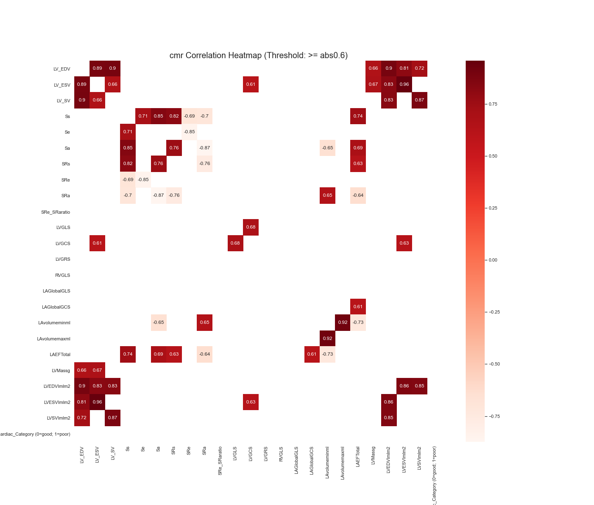

</details>
<br>

### **Display correlation of physical functional parameters and LVEF (Cell 6)**

Motivation: LVEF and E_A_ratio are the most important features in predicting cardiac category. We want to see if any physical functional parameters (Which are presumed to be easily obtainable) is correlated with these important features so that they can be used instead of the harder-to-obtain echo parameters

```python
regData1 = data[physFuncParamsCols] 
regData1 = ["LVEF"]
outputCorrData(regData1,threshold=0,filename="PhysFunc and LVEF")
outputCorrData(regData1,threshold=0,filename="LVEF")
```

Comments: There is no significant correlation between physical functional parameters and LVEF.

<details>
<summary>Correlation Heatmap Output</summary>

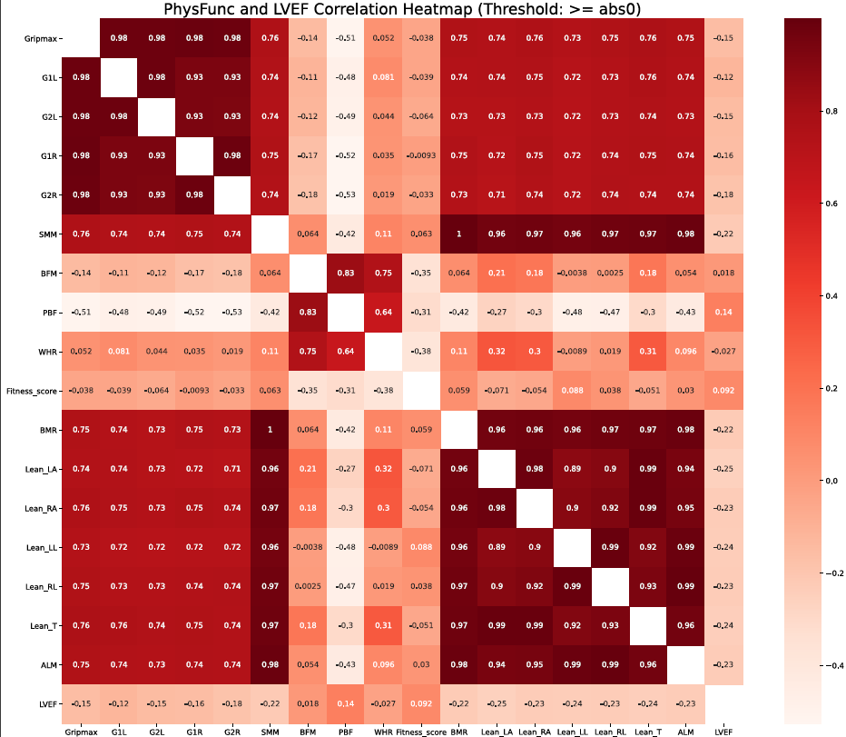

</details>
<br>

### **Display correlation of physical functional parameters and E_A_ratio (Cell 7)**

```python
regData2 = data[physFuncParamsCols + ["E_A_ratio"]]
outputCorrData(regData2,threshold=0,filename="PhysFunc and E_A_ratio")
```

Comments: There is no significant correlation between physical functional parameters and E_A_ratio as well. This supports the notion that physical functional paramters do not have much power in predicting cardiac category.

<details>
<summary>Correlation Heatmap Output</summary>

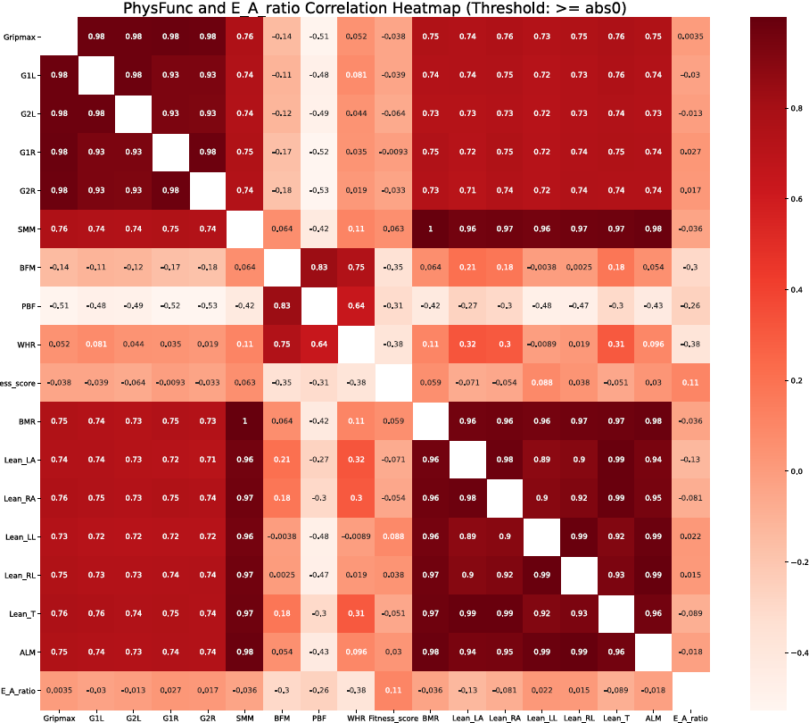

</details>
<br>

## **Data Analysis**

___

### **Use full data to classify cardiac category (Cell 8)**

Motivation: To see if the full set of data has power in predicting cardiac category, and to see which model would perform this task well.

```python
targetFeat = "Cardiac_Category (0=good; 1=poor)"
compareClasModel(data_full,targetFeat,title=f"Model comparison for full data, target={targetFeat}",showImportance = True)

```

<details>
<summary>Graph Output</summary>

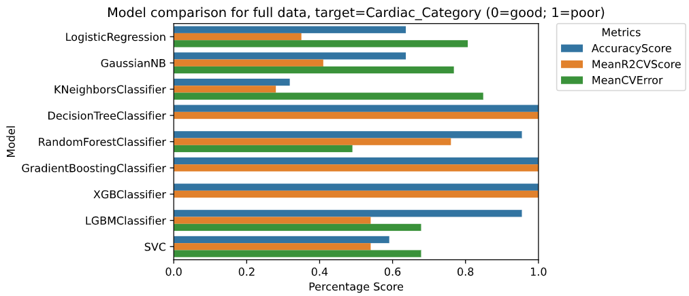

</details>
<br>

Comments: Graph output shows perfect cross-validation accuracy from 3 classifiers (Decision Tree, XGBoost and Gradient Boost), with decent results from RandomForest and mostly unremarkable results from the rest.

<details>
<summary>Feature Importance</summary>

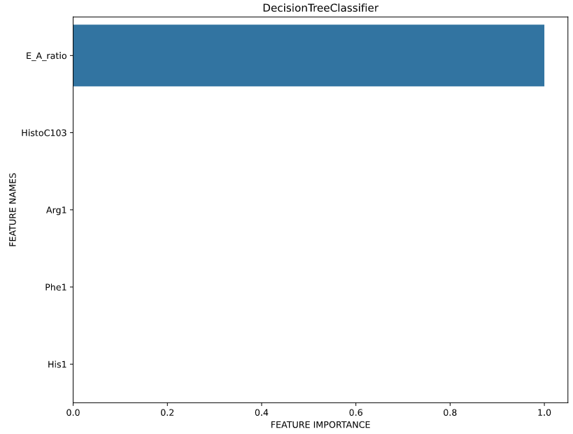

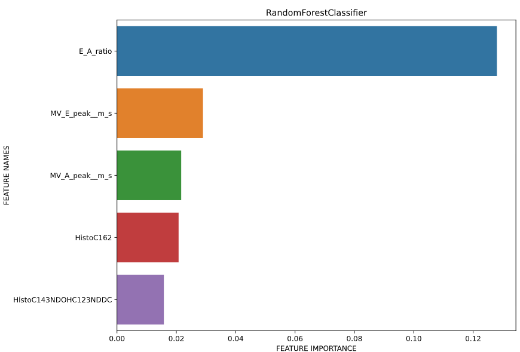

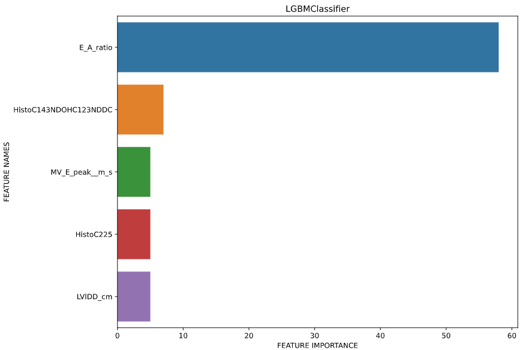

</details>
<br>

Comments: With `showImportance = true`, we see that E_A_ratio has by far the most influence in predicting cardiac category.

### **Use each feature set to predict cardiac category (Cell 9)**

Motivation: To see which set of features have the most power in predicting cardiac cateogry, and to see which model would perform this task well.

```python
targetFeat = "Cardiac_Category (0=good; 1=poor)"
for key in cc_dfDict:
    compareClasModel(cc_dfDict[key],targetFeat,title=f"Model comparison for {key}, target={targetFeat}")

```

Comments: As expected, echo (100% CV score) is the best set of parameters to use for predicting cardiac category. This is followed by Blood Biomarkers (77% CV score), cmr (74% CV score), and Physical Functional Parameters (73%). Check/run the python notebook for full set of graphs.

<details>
<summary>Example Graph Output</summary>

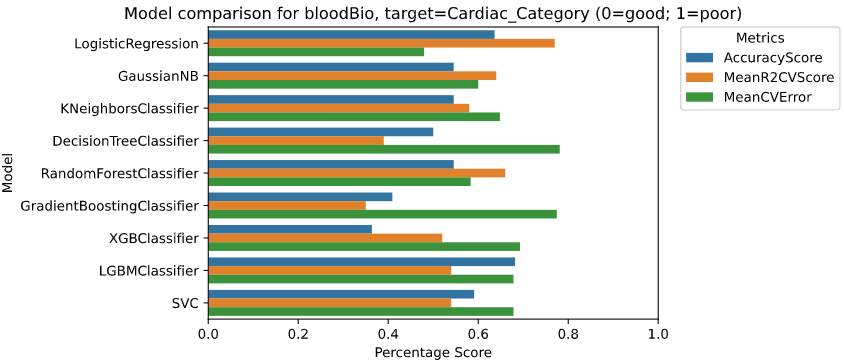

</details>
<br>

### **Use of full data EXCEPT E_A_ratio to classify cardiac category (Cell 10)**

Motivation: To confirm the predictive power of E_A_ratio and to check if there are any other features with predictive power, or if there is any predictive power left at all without E_A_ratio.

```python
targetFeat = "Cardiac_Category (0=good; 1=poor)"
noEAratio = data_full.drop("E_A_ratio",axis = 1)
compareClasModel(noEAratio,targetFeat,title=f"Model comparison without E_A_ratio, target={targetFeat}",showImportance = True)

```

<details>
<summary>Graph Output</summary>

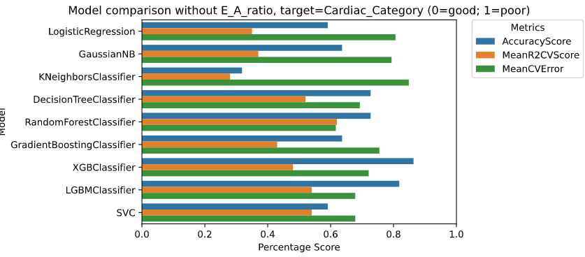

</details>
<br>

Comments: Result shows that other params have little relevance. Only E_A_ratio is necessary to predict cardiac category.

### **Predicting cardiac category with *regression* using only echo parameters  (Cell 11)**

Motivation: To confirm the predictive power of echo parameters (specifically, E_A_ratio) and to check if results of regression models are consistent with classification models.

```python
compareRegModel(cc_dfDict["echo"],"Cardiac_Category (0=good; 1=poor)",title="Cardiac category with echo",showImportance=False)
```

<details>
<summary>Graph Output</summary>

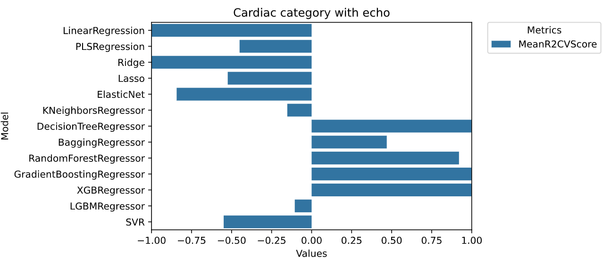

</details>
<br>

Comments: Result confirm that echo parameters (specifically E_A_ratio) is sufficient to predict cardiac category. Results from regression models are consistent with that of classification models

### **Using all feature (Except Cardiac Category) to predict E_A_ratio through regression (Cell 12)**

Motivation: To check if it is possible to predict E_A_ratio using other parameters (without using Cardiac Category).

```python
targetFeat = "E_A_ratio"
regOnEARatio = data_full.drop("Cardiac_Category (0=good; 1=poor)",axis = 1)

compareRegModel(regOnEARatio,targetFeat,title="predicting E_A_ratio with full data",showImportance = True)
```

<details>
<summary>Graph Output</summary>

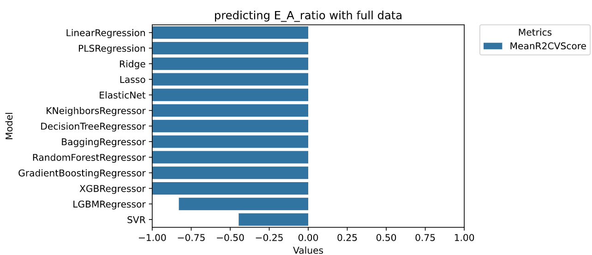

</details>
<br>

Comments: Result shows extremely poor performance. This could mean one or more of the following:

- Regression methods are flawed/not appropriate for this use case.
- Regression methods need more tuning for greater accuracy.
- Insufficient number of patient data.
- Not possible to predict E_A_ratio given the current feature set.

### **Attempting to predict LVEF and E_A_ratio using physical functional parameters through regression (Cell 13)**

<br>
Motivation: LVEF and E_A_ratio are the most important features in predicting cardiac category. We want to see if physical functional parameters (Which are presumed to be easily obtainable) can be used to predict these important echo parameters.

```python
compareRegModel(regData1,"LVEF",title="LVEF using physFuncParamsCols", showImportance=True)
compareRegModel(regData2,"E_A_ratio",title="E_A_ratio using physFuncParamsCols", showImportance=True)
```

<details>
<summary>Graph Output</summary>


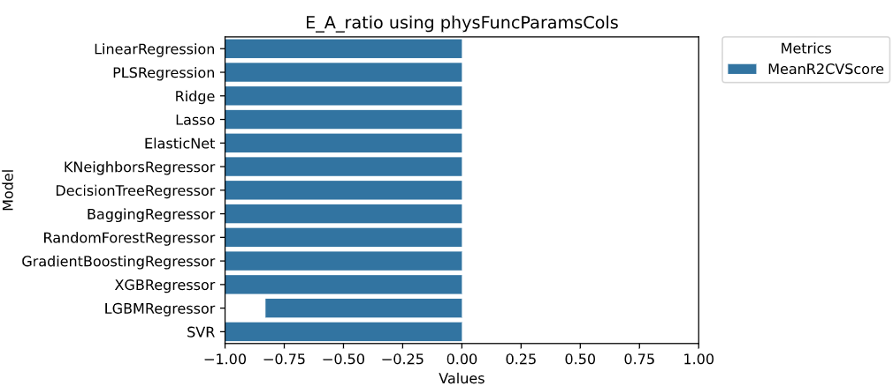

</details>
<br>

Comments: Result shows extremely poor performance in predicting either LVEF or E_A_ratio with physical functional paramters using regression. This could mean one or more of the following:

- Regression methods are flawed/not appropriate for this use case.
- Regression methods need more tuning for greater accuracy.
- Insufficient number of patient data.
- Not possible to predict LVEF and E_A_ratio given the current feature set.

### **Using all feature (Except echo and cmr) to classify cardiac category + check feature importance (Cell 14)**

<br>

Motivation: Since echo and cmr are already known to have clinical significance, we now want to see if there are other features that can be used to predict cardiac category. We also want to find the most important non-echo and non-cmr features that we can combine to make a smaller and more curated set of features.

```python
data_trunc = data_full.drop(echoCols+cmrCols, axis=1)
data_trunc # Removal of the 2 most predictive sets of features
targetFeat = "Cardiac_Category (0=good; 1=poor)"
compareClasModel(data_trunc,targetFeat,title=f"Model comparison for truncated data, target={targetFeat}",showImportance = True)
```

<details>
<summary>Graph Output</summary>

")

</details>
<br>

<details>

<summary>Feature importance</summary>

")

")

</details>
<br>

Comments: Result show poor performance. Some of the more significant features include the following: `["VO2Max","HistoC162","C5OHC3DC","WHR","HistoC163NDOHC143NDDC","HistoHis1_ConcµM","C222","Pulse","Hips_Circumference__cm","Cit1","qTL","HistoC16"]`

### **Manual extraction and combination of most important features in attempt to make a curated and predictive feature set (Cell 15)**

Motivation: We want to see if a curated (from cell 14) set of features could be used to predict cardiac category.

```python
# Manually combine most important features
mostImptCols = ["VO2Max","HistoC162","C5OHC3DC","WHR","HistoC163NDOHC143NDDC","HistoHis1_ConcµM","C222","Pulse","Hips_Circumference__cm","Cit1","qTL","HistoC16","Cardiac_Category (0=good; 1=poor)"]
curatedDf = data_full[mostImptCols]

# Scores got even worse
targetFeat = "Cardiac_Category (0=good; 1=poor)"
compareClasModel(curatedDf,targetFeat,title=f"Model comparison for curated data, target={targetFeat}")
```

<details>
<summary>Graph Output</summary>

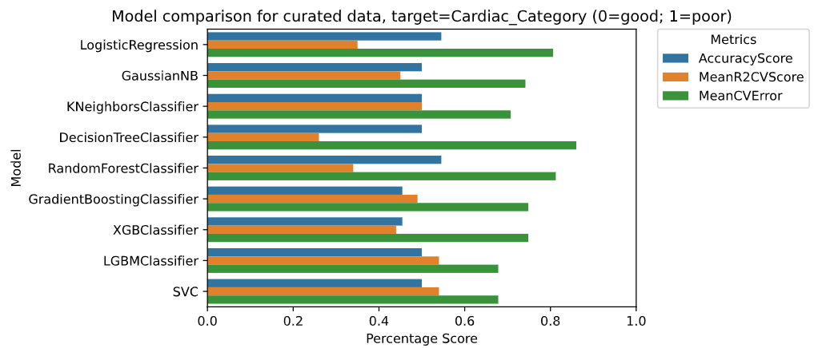

</details>
<br>

Comments: Performance is worse than in cell 14. This could mean one or more of the following:

- Methodology in curating this list is flawed.
- Insufficient number of patient data.

Perhaps adivce from a clinical perspective would be useful in curating such a list.

## **Hyperparameter Tuning**

___

### **Grid search for tuning LGBM to predict E_A_ratio using physical functional parameters (Cell 16)**

Motivation: To see if we can improve the peformance of certain regression models (LGBMRegressor in this case) for the purpose of predicting E_A_ratio using easily-obtainable patient parameters.

```python
df = regData2
target = "E_A_ratio"
params = {"n_estimators": [50,100, 500],
          "subsample": [0.2,0.4, 0.6, 0.8, 1.0],
          "max_depth": [2, 3, 4, 5],
          "learning_rate": [0.1, 0.01, 0.02, 0.05],
          "min_child_samples": [5, 10, 20, 40]}
y = df[target]
df = df.drop(target, axis = 1)
x = preprocessDf(df)

#print("Predicting " + title)
xTrain,xTest,yTrain,yTest = train_test_split(x,y,test_size=0.25,random_state=0)  
xTrain = xTrain.fillna(xTrain.median())
xTest = xTest.fillna(xTrain.median())
lgbmr = LGBMRegressor().fit(xTrain,yTrain)
cv = GridSearchCV(lgbmr,params,cv=5,verbose=1,n_jobs=-1,scoring="r2").fit(xTrain,yTrain)
print(cv.best_params_)
print(cv.best_score_)
```

<details>
<summary>Output</summary>

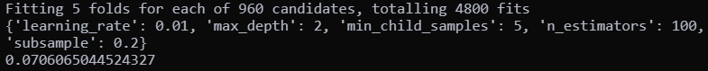

</details>
<br>

Comment: LGBMRegressor model performance improved, but still remains too poor to predict E_A_ratio.

### **Grid search for tuning RandomForestRegressor to predict E_A_ratio using physical functional parameters (Cell 17)**

Motivation: To see if we can improve the peformance of certain regression models (RandomForestRegressor in this case) for the purpose of predicting E_A_ratio using easily-obtainable patient parameters.

```python
df = regData2
target = "E_A_ratio"
params = {
    'bootstrap': [True],
    'max_depth': [80,100, 120, 150],
    'max_features': [2, 3, 4, 5],
    'min_samples_leaf': [3, 4, 5, 6,7,8],
    'min_samples_split': [14,16,18,20],
    'n_estimators': [5,10,25]
}
y = df[target]
df = df.drop(target, axis = 1)
x = preprocessDf(df)

#print("Predicting " + title)
xTrain,xTest,yTrain,yTest = train_test_split(x,y,test_size=0.25,random_state=0)
xTrain = xTrain.fillna(xTrain.median())
xTest = xTest.fillna(xTrain.median())
rf = RandomForestRegressor().fit(xTrain,yTrain)
# Instantiate the grid search model
cv = GridSearchCV(rf,params,cv = 5, n_jobs = -1, verbose = 2,scoring="r2").fit(xTrain,yTrain)

print(cv.best_params_)
print(cv.best_score_)
```

<details>
<summary>Output</summary>

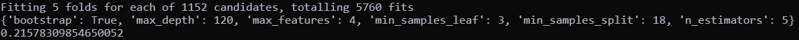

</details>
<br>

Comment: RandomForestRegressor model performance improved, but still remains too poor to predict E_A_ratio.
